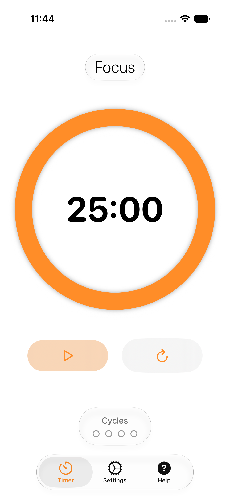
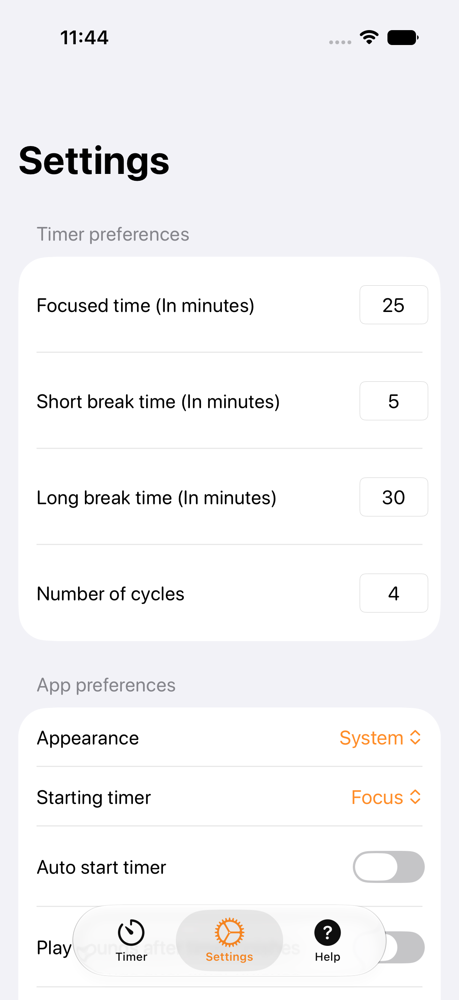
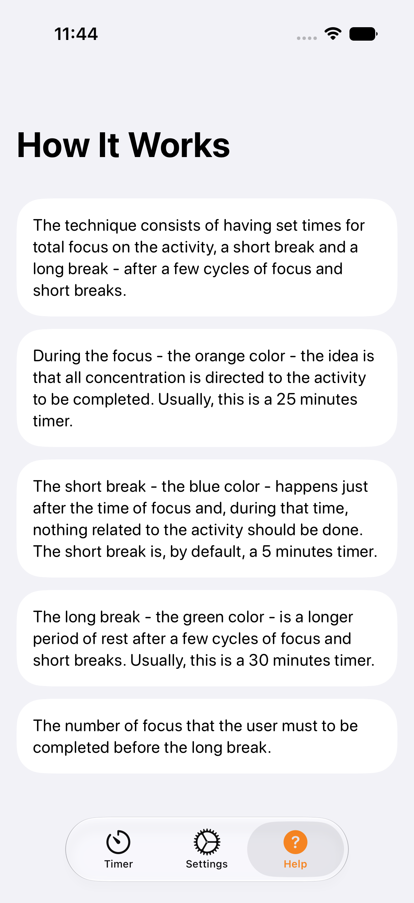

# Focused Timer

A Pomodoro timer app for iOS that helps you concentrate and finish tasks by making it simple to follow the Pomodoro technique.

## Screenshots

| Timer | Settings | Help |
|---|---|---|
|  |  |  |

## Motivation

This app has always been a playground for me to learn new things. Version 1.0 was created when I wanted to learn how `SwiftUI` works and to get more familiar with the `MVVM` architecture. While thinking about a good candidate app, the need for a personal timer became apparent — so the two goals merged into one: build the app you'd actually use.

Version 2.0 was a more radical experiment: learning what I can do using AI to code an entire set of features end to end — from the domain logic and App Intents to AlarmKit integration and the test suite.

Version 2.1 continues that experiment, starting with a "What's New" screen so returning users can see what changed.

## Features

### Timer Types

- **Focus** — Default 25 minutes. The main work session, shown in the accent (orange) color.
- **Short Break** — Default 5 minutes. A quick rest between focus sessions, shown in blue.
- **Long Break** — Default 30 minutes. An extended rest after completing a full cycle, shown in green.

### Cycle Tracking

The app tracks how many focus sessions you've completed. After a configurable number of sessions (default: 4), a long break is triggered automatically. The current cycle progress is displayed as `X/Y` on the main screen.

### Timer Controls

- **Play / Pause** — Starts or pauses the current timer.
- **Reset** — Returns the timer to its initial state.

Both controls include haptic feedback.

### Live Activities

While a timer is running or paused, its phase, countdown, progress, and completed cycles appear in a Live Activity on the Lock Screen and Dynamic Island. The system can also surface the activity in StandBy and on compatible Apple Watch, Mac, and CarPlay experiences. Tapping it opens the Timer tab.

The countdown is rendered locally from its start and end dates, so it remains smooth without waking the app every second. ActivityKit receives updates only for meaningful changes such as start, pause, resume, phase changes, reset, completion, and preference changes. Apple does not guarantee a numeric minimum or maximum local update cadence, so there is no frequency setting. iOS can keep a Live Activity active for up to eight hours and can retain the completed Lock Screen presentation for up to four more hours; Focused Timer reconciles or recreates the current activity when it next runs.

### Settings

All timer values and app behaviors are fully configurable:

| Setting | Default |
|---|---|
| Focused time | 25 minutes |
| Short break | 5 minutes |
| Long break | 30 minutes |
| Number of cycles | 4 |
| Auto-start next timer | Off |
| Play sounds on completion | On |
| Keep screen on | Off |
| Live Activities | On |

Settings are persisted across launches. A **Reset to Defaults** option is available with a confirmation dialog.

### Notifications

Local push notifications are scheduled when the timer finishes while the app is in the background. Notifications are automatically cleared when the app returns to the foreground.

### Background Handling

When the app moves to the background, the current timestamp is saved. On return, elapsed time is calculated and the timer is updated accordingly — even if the app was terminated and relaunched. Live Activities use the same canonical timer state and a system-rendered date range, then reconcile on foreground return instead of relying on per-second background execution.

### Help Screen

An in-app help screen explains the Pomodoro technique and each timer type, fully localized.

### What's New

The first time the app is opened after an update that has release notes, a "What's New" sheet shows what changed in the latest version. It never appears on a fresh install, and it never appears twice for the same version.

The full release history is always available from **Settings → What's New**, independent of whether the modal has been seen.

## Technologies

- **SwiftUI** — Declarative UI framework
- **ActivityKit / WidgetKit** — Lock Screen and Dynamic Island timer presentation with local countdown rendering
- **MVVM** — Architecture pattern with protocol-based dependency injection for full unit testability
- **App Intents** — Siri & Shortcuts integration to start, pause, reset, and configure the timer hands-free
- **AlarmKit** — Schedules an alarm that rings even when the device is in silent mode
- **StoreKit** — Requests an App Store review after a full Pomodoro set completes
- **XCTest / Swift Testing** — Unit, UI, and snapshot tests
- **UserDefaults** — Local persistence via a `StorageRepository` abstraction
- **UNUserNotificationCenter** — Local push notifications
- **Xcode Cloud** — CI/CD pipeline
- **SwiftLint** — Static analysis enforced on every build

## Architecture

### MVVM with Protocol-Based Dependency Injection

All major dependencies are abstracted behind protocols so unit tests run without real system services:

| Protocol | Purpose |
|---|---|
| `TimerModelProtocol` / `SettingsModelProtocol` | Data access |
| `RepeatingTimerFactoryProtocol` / `RepeatingTimerProtocol` | Timer creation |
| `LocalNotificationManaging` / `UserNotificationCenterProtocol` | Notifications |
| `SystemSoundPlaying` | Audio feedback |
| `NotificationFlagStoring` | Lightweight UserDefaults flag access |
| `AlarmScheduling` | AlarmKit integration |
| `LiveActivityManaging` / `LiveActivityClient` | Serialized ActivityKit lifecycle and testable system access |
| `StorageRepository` | Key-value persistence |
| `ChangelogLoading` / `ChangelogDataProviding` | Loads and decodes the bundled changelog |
| `WhatsNewModelProtocol` | Persists which release the user has already seen |

`TimerViewModel` accepts all of these as constructor parameters, enabling full injection of test doubles.

### Data Layer

`UserDefaultsRepository` is a generic `UserDefaults` wrapper conforming to the `StorageRepository` protocol. `TimerModel` and `SettingsModel` are thin structs that delegate entirely to it, and tests swap in an in-memory implementation.

### Localization

All user-facing strings live in `Focused Timer/Focused Timer/Shared/Constants/Localizable.xcstrings`.

Supported languages:
- English (`en`)
- Portuguese — Brazil (`pt-BR`)

Release notes are not part of the string catalog. Each supported language has its own changelog
file under `Focused Timer/Focused Timer/WhatsNew/Resources/Changelog_<language>.json`, resolved
at runtime by `BundleChangelogLoader` against `Bundle.main.preferredLocalizations`, falling back
to English. Adding a language means adding both a `Changelog_<language>.json` file **and** an
entry in `LocalizationTests.supportedLanguages` — the localization test suite checks the two stay
in sync, and fails the build if a release is added to one language's changelog but not the
other's.

### What's New

`WhatsNewUseCase` decides whether to show the modal by comparing the newest version *present in
the changelog* against the highest version the user has already seen (persisted via
`WhatsNewModelProtocol`) — not against the app's own `MARKETING_VERSION`. That means:

- A fresh install seeds the "last seen" version silently; nothing is shown.
- A patch release with no changelog entry shows nothing.
- Skipping several versions shows only the newest release's notes.
- A downgrade never shows anything and never moves the stored watermark backwards.

The release is marked as seen at presentation time, not on dismiss, so a force-quit mid-read
can't reopen the same notes on the next launch — the full changelog in Settings covers that case
instead.

### Swift 6 Concurrency

- `TimerViewModel` is **not** `@MainActor` — it's an `ObservableObject` without main actor isolation.
- `SettingsViewModel` **is** `@MainActor`.
- `AppDelegate` uses `@preconcurrency UNUserNotificationCenterDelegate`.

## Testing

### Unit Tests

- `TimerViewModelTests`
- `SettingsViewModelTests`
- `LiveActivityTests`
- `LocalNotificationManagerTests`
- `AppDelegateTests`
- `TimerViewLifecycleTests`
- `LocalizationTests`
- `AppVersionTests`
- `ChangelogTests`
- `ChangelogLoaderTests`
- `ChangelogResourceTests` — integration tests against the real bundled changelog files
- `WhatsNewUseCaseTests`
- `WhatsNewViewModelTests`
- `ChangelogEntryStyleTests`

### UI Tests

All UI tests extend `BaseFeature`, an `@MainActor` base class. The app supports a `"UI-Testing"` launch argument that clears `UserDefaults`, disables animations, and accepts fast timer durations via environment variables (`UI_TEST_FOCUSED_SECONDS`, `UI_TEST_SHORT_BREAK_SECONDS`, `UI_TEST_LONG_BREAK_SECONDS`, `UI_TEST_NUMBER_OF_CYCLES`).

`"UI-Testing"` also suppresses the "What's New" modal, since it wipes `UserDefaults` on every
launch and would otherwise re-trigger the modal on every run. A subclass that needs to exercise
the modal opts in by overriding `extraLaunchArguments` to include `"UI-Testing-WhatsNew"`, which
forces it to appear for that run — see `WhatsNewForcedUITests`.

```bash
# Run all tests
xcodebuild test \
  -project "Focused Timer/Focused Timer.xcodeproj" \
  -scheme "Focused Timer" \
  -destination "platform=iOS Simulator,name=iPhone 16"

# Run only unit tests
xcodebuild test \
  -project "Focused Timer/Focused Timer.xcodeproj" \
  -scheme "Focused Timer" \
  -destination "platform=iOS Simulator,name=iPhone 16" \
  -only-testing "Focused TimerTests"
```

## SwiftLint

SwiftLint runs as an Xcode build phase on every build. No specific version is pinned — the lint rules are version-agnostic, so the latest SwiftLint works fine.

- Install locally: `brew install swiftlint`
- Run manually from the project root:

```bash
swiftlint lint --config "Focused Timer/.swiftlint.yml"
```

Key constraints:
- 4-character minimum for identifier names
- 120-character line length limit
- `explicit_self` analyzer rule enabled

Xcode Cloud installs the latest SwiftLint via `ci_scripts/ci_post_clone.sh` before each build.

## Release Checklist

1. Add the new release to **both** `Changelog_en.json` and `Changelog_pt-BR.json` under `Focused Timer/Focused Timer/WhatsNew/Resources/`, with the same `version` in each.
2. Bump `MARKETING_VERSION` (and `CURRENT_PROJECT_VERSION`) in `project.pbxproj`.
3. Run `ChangelogResourceTests` — it fails if a version is missing from either language, if any entry is untranslated, or if the changelog announces a version ahead of the build.
4. Re-record the `SettingsSnapshotTests` `FormView` snapshots only if the Settings layout changed. Live Activity presentation snapshots cover Lock Screen and Dynamic Island variants.

## Download

The app is available on the [App Store](https://apps.apple.com/app/focused-timer/id1563481123).
